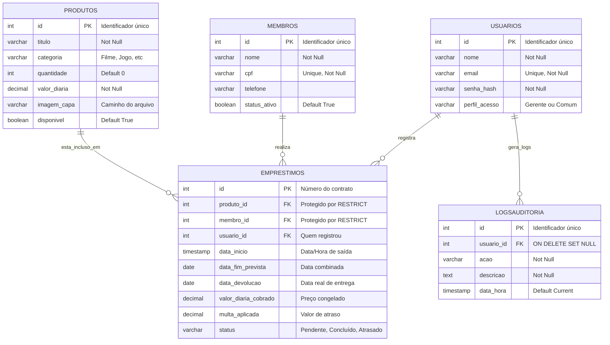
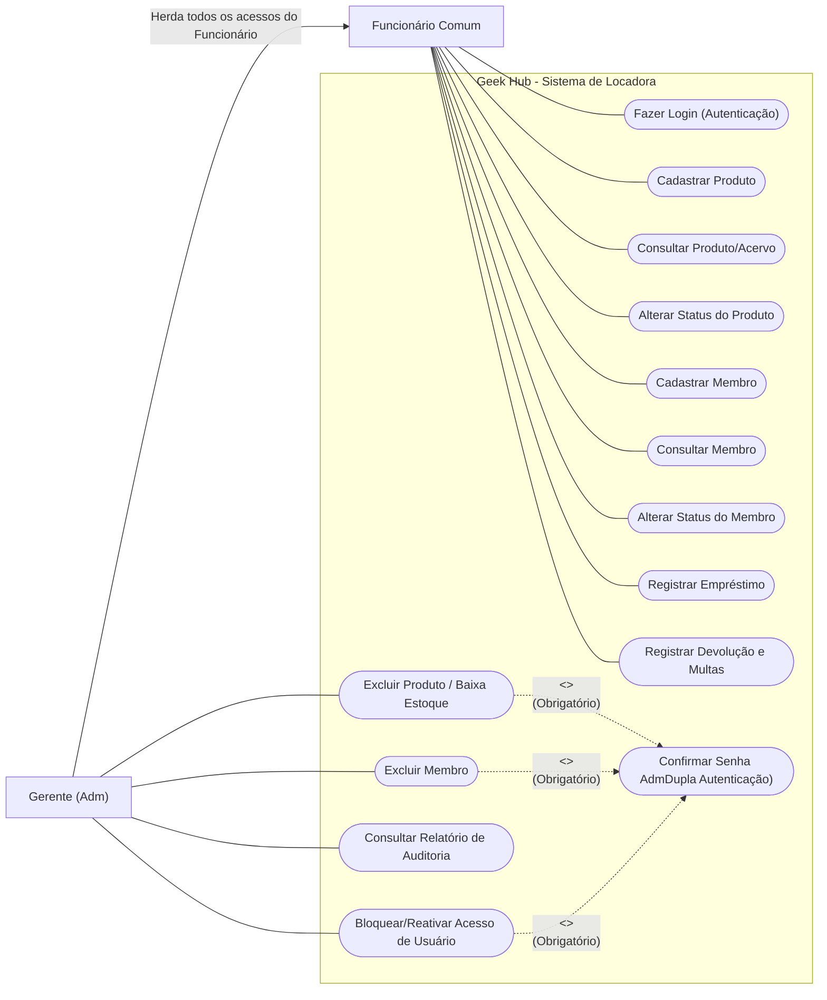
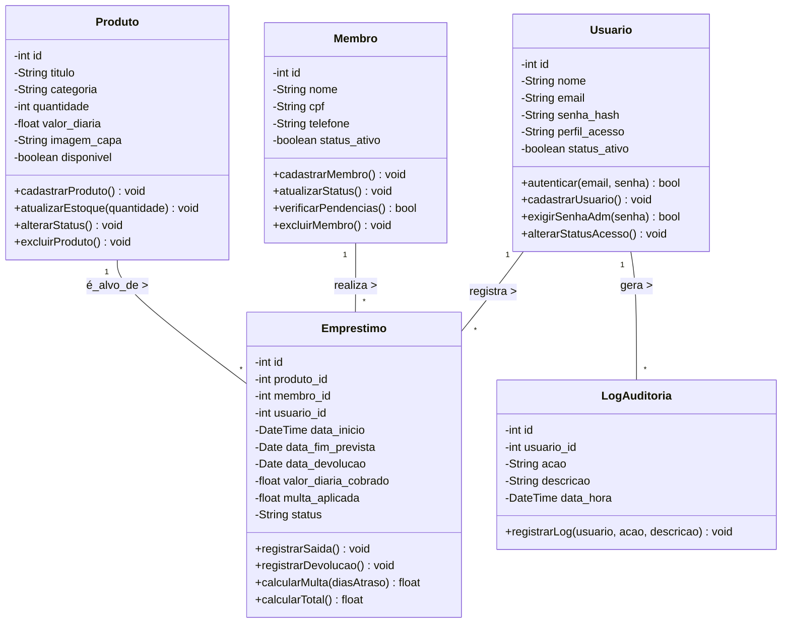
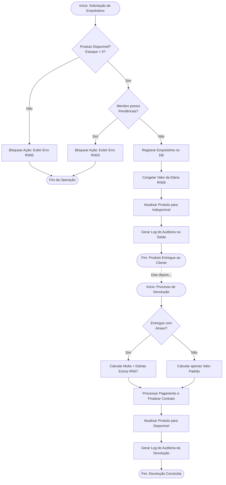

# Geek Hub - Sistema de Gestão para uma Locadora

O **Geek Hub** é uma aplicação web desenvolvida em PHP com foco no gerenciamento de uma locadora de filmes, jogos, mangás e produtos do universo geek. O sistema foi criado com o objetivo de facilitar e padronizar o processo de cadastro e controle dos itens disponíveis para aluguel/empréstimo, oferecendo uma interface simples, organizada e eficiente para os funcionários da locadora.

A plataforma permite realizar operações essenciais de gerenciamento, como cadastro, listagem, edição e exclusão de registros, utilizando o conceito de CRUD integrado a um banco de dados PostgreSQL. Dessa forma, o sistema auxilia no controle das informações dos produtos e usuários, tornando o atendimento mais rápido, prático e organizado.

---

## Como Executar o Projeto Localmente

Para rodar este projeto na sua máquina, será necessário ter instalado um ambiente de servidor local (**PHP**) e o banco de dados **PostgreSQL**.

### Pré-Requisitos 
* **PHP** (v7.4 ou superior) habilitado com a extensão `pdo_pgsql`.
* **PostgreSQL** instalado e a rodar na porta `5432`padrão).
* **Git** instalado na máquina.

### Passo 1: Clonar o Repositório

Abra o terminal e execute:
```
# Clone este repositório
git clone https://github.com/inumaki-david/Geek-Hub.git

# Acesse a pasta do projeto
cd geek-hub
```

### Passo 2: Configurar o Banco de Dados (Restore do Dump)

O projeto já conta com um ficheiro de dump.sql) com toda a estrutura das tabelase possivelmente dados iniciais) localizada na pasta /db/. Siga os passos abaixo para recriar o banco no seu PostgreSQL:

* 1 - Abra o terminalPrompt de Comando ou PowerShell).

* 2 - Conecte-se ao PostgreSQL usando o seu usuário principal (geralmente `postgres`): 
```
psql -U postgres
```
* 3 - Se o banco de dados já existir de testes anteriores, apague-o e crie um novo para evitar conflitos de tabelas. Dentro do terminal interativo do `psql`, digite:
```
DROP DATABASE IF EXISTS [geekhub_db];
CREATE DATABASE [geekhub_db];
\q
```
* 4 - Navegue para a pasta `db` do projeto clonado e restaure o banco de dados executando o seguinte comando:
```
# Supondo que você esteja na raiz do projeto clonado
cd db

# Restaura o banco de dados
psql -U postgres -d geekhub_db -f dump_geekhub.sql

# Volte para a raiz do projeto
cd ..
```

### Passo 3: Configurar a Conexão no PHP

* 1 - Na raiz do projeto, abra o ficheiro `connect.php`.

* 2 - Altere as credenciais para corresponderem às do seu ambiente local PostgreSQL:
```
$host = 'localhost';
$port = '5432';
$dbname = '[nome_bd]'; // O mesmo nome que criou no Passo 2
$user = 'postgres'; // O seu usuário do PostgreSQL
$password = 'sua_senha_aqui'; // A sua senha do PostgreSQL
```

### Passo 4: Acessar a Aplicação

Com o banco de dados configurado, inicie o servidor embutido do PHP.
Certifique-se de que o seu terminal está na raiz do projeto e execute:
```
php -S 0.0.0.0:3007
```
O servidor estará ativo! Agora, basta abrir o seu navegador de preferência e acessar:
```
http://localhost:3007
```

### Passo 5: Informações de Entrada
Utilize essas informações para entrar no sistema.

**E-mail**: `davi@geekhub.com` 
**Senha**: `1234`

---

## Especificação de Requisitos de Software
Especificação dos Requisistos de Software (SRE)  
Estrutura Baseada na ISO/IEC/IEEE 29148:2018

## 1. Introdução

#### 1.1 Escopo do Sistema
Este documento define os requisitos para a aplicação **Geek Hub** que tem como escopo o gerenciamento básico de uma locadora geek por meio de uma aplicação web. A plataforma será responsável pelo controle dos itens disponíveis no acervo, permitindo operações de cadastro, consulta, atualização e remoção de registros.  

O sistema também permitirá o gerenciamento de empréstimos, possibilitando consultar a disponibilidade de produtos e registrar informações relacionadas aos usuários da locadora. Entre os itens gerenciados estão filmes, jogos, mangás e outros produtos do universo geek.  

A aplicação será desenvolvida utilizando **PHP** para o back-end e **PostgreSQL** para o armazenamento dos dados, oferecendo uma estrutura organizada e funcional para auxiliar no controle das operações da locadora.

#### 1.2 Propósito
O projeto Geek Hub tem como propósito desenvolver uma aplicação web capaz de auxiliar no gerenciamento de uma locadora geek, tornando o controle de itens e empréstimos mais prático, organizado e eficiente.  

Além disso, o sistema busca aplicar na prática conceitos de desenvolvimento web, integração com banco de dados e operações CRUD utilizando PHP e PostgreSQL.

---

## 2. Descrição Global

#### 2.1 Prototipagem Figma - Média Fidelidade

[Prototipagem Figma](https://www.figma.com/design/i6kSmnOXzrAJUnJAjW2FNw/Prototipagem---Geek-Hub?node-id=0-1&t=ekYmz7CDrs0KIXR7-1)

#### 2.2 Funções do Sistema
O sistema deve realizar as seguintes funções principais:
* Cadastrar funcionários/gerentes da locadora.
* Realizar o login de funcionários/gerentes da locadora.
* Cadastrar novos títulos/produtos disponíveis.
* Consultar todos os títulos/produtos disponíveis.
* Realizar o empréstimo dos títulos/produtos.
* Alterar o estado do título/produto, se está disponível ou não.
* Deletar um título/produto com sistema de verificação.
* Cadastrar novos membros (clientes).
* Alterar o estado do membro, se está ativo ou não (se possuí algum empréstimo ou não).
* Consultar todos os membros cadastrados.
* Deletar membros com sistema de verificação.
* Bloquear e Reativar o acesso de funcionários ao sistema.
* Registar automaticamente um log de auditoria para ações críticas (cadastro, edição, exclusão e empréstimos).
* Consultar painel de auditoria de logsexclusivo para Gerentes).

#### 2.3 Características do Usuários
| Usuário | Descrição |
| :--- | :--- | 
| **GerenteAdm)** | Usuário que possui total acesso ao sistema, pode realizar todas as operações de consulta e cadastro e exclusão de títulos/produtos disponíveis, porém precisa autenticar e confirmar com sua senha de adm. |
| **Funcionário Comum** | Usuário não possui acesso livre a todas as operações do sistema. Pode realizar cadastro e consulta porém não pode realizar a exclusão de nenhum título/produto. |

---

## 3. Requisitos do Sistema 

### 3.1 Requisitos Funcionais

#### Módulo de Acesso e Segurança
| ID | Título | Descrição | Prioridade |
| :--- | :--- | :--- | :--- |
| **RF01** | Autenticação de Utilizadores | O sistema deve possuir uma tela de login para validar as credenciais de acesso, identificando se o utilizador logado é um "GerenteAdm)" ou um "Funcionário Comum". | Alta |
| **RF02** | Cadastro de Colaboradores | O sistema deve possuir uma interface que permita o registo de novos gerentes e funcionários no banco de dados. | Alta |
| **RF03** | Controle de Permissões de Exclusão | O sistema deve bloquear o acesso à função de exclusão de produtos/títulos para os utilizadores com o perfil de "Funcionário Comum". | Alta |
| **RF04** | Verificação Administrativa | O sistema deve exigir a confirmação explícita da senha do "GerenteAdm)" antes de concluir qualquer operação de exclusão no sistema. | Alta |
---
#### Módulo de Gestão de Acervo 
| ID | Título | Descrição | Prioridade |
| :--- | :--- | :--- | :--- |
| **RF05** | Cadastro de Produtos | O sistema deve fornecer um formulário para inserir novos títulos no acervofilmes, jogos, mangás e outros produtos geeks, a quantidade de um mesmo produto que será cadastrado) e um campo de upload para anexar a capa promocionalimagem) do produto. | Alta |
| **RF06** | Consulta de Produtos | O sistema deve listar todos os títulos e produtos cadastrados, permitindo a leitura e visualização de todas as informações do acervo e exibir a imagem da capa/produto em miniatura juntamente com a leitura de todas as informações do acervo. | Alta |
| **RF07** | Alteração de Status do Produto | O sistema deve permitir a atualização do estado do produto, indicando claramente se a sua situação atual é "Disponível" ou "Indisponível". | Alta |
| **RF08** | Exclusão Segura de Produtos | O sistema deve permitir a remoção de um título do banco de dadose do arquivo físico de imagem) mediante um sistema de verificaçãoconfirmação em duas etapas) para evitar apagamentos acidentais. | Alta |
---
#### Módulo de Gestão de Clientes e Empréstimos
| ID | Título | Descrição | Prioridade |
| :--- | :--- | :--- | :--- |
| **RF09** | Cadastro de Membros | O sistema deve permitir o registo de novos membrosclientes) que irão frequentar a locadora. | Média | 
| **RF10** | Consulta de Membros | O sistema deve listar todos os membros cadastrados na plataforma para fácil visualização por parte dos funcionários. | Média |
| **RF11** | Atualização de Status do Membro | O sistema deve possuir a capacidade de alterar o estado do membroex: Ativo ou Inativo), com base na regra de negócio que verifica se ele possui ou não um empréstimo em andamento. | Média | 
| **RF12** | Exclusão Segura de Membros | O sistema deve permitir apagar o registo de um membro do banco de dados, utilizando também um sistema de verificação e confirmação de segurança. | Média | 
| **RF13** | Registo de Empréstimo | O sistema deve disponibilizar uma funcionalidade que permita realizar e gravar o empréstimo de um produto específico para um membro cadastrado. | Alta |
---
#### Módulo de Empréstimo 
| ID | Título | Descrição | Prioridade |
| :--- | :--- | :--- | :--- |
| **RF14** | Controle de Datas | O sistema deve registrar automaticamente a *data_inicio* (data e hora atuais do momento do aluguel) e permitir que o funcionário defina a *data_fim_prevista* (quando o cliente promete devolver). | Média |
| **RF15** | Definição de Valor da Diária | O sistema deve associar um valor financeiro de diária ao empréstimo.Lançamentos podem ter diárias mais caras que itens de catálogo antigo). | Média |
| **RF16** | Registro de Devolução | O sistema deve possuir uma tela ou botão para registrar a "Devolução", capturando a *data_devolucao_real*. | Média |
| **RF17** | Cálculo Automático de Multa e Total | No momento da devolução, o sistema deve calcular o valor total a ser pagoDias alugados $\times$ Valor da diária) e somar uma multa caso a *data_devolucao_real* seja maior que a *data_fim_prevista*. | Média |
---
#### Módulo de Auditoria e Gestão de Usuários
| ID | Título | Descrição | Prioridade |
| :--- | :--- | :--- | :--- |
| **RF18** | Rastreio de Ações (Logs) | O sistema deve gravar automaticamente um log com a ação, descrição (com nomes), data/hora e o autor de qualquer operação de escritaCRUD) no banco. | Alta |
| **RF19** | Painel de Auditoria | O sistema deve fornecer um painel exclusivo para o Gerente consultar e filtrar (por data, usuário ou palavra-chave) os logs de ações do sistema. | Alta |
| **RF20** | Bloqueio de Usuários | O sistema deve permitir que um Gerente inative/bloqueie o acesso de outros funcionários sem excluí-los do banco de dados. | Alta |
---

### 3.2 Requisitos Não Funcionais

#### Módulo de Ambiente e Arquitetura
| ID | Título | Descrição | Prioridade |
| :--- | :--- | :--- | :--- |
| **RNF01** | Tecnologias Base | O back-end do sistema deve ser desenvolvido estritamente na linguagem **PHP** e utilizar o SGBD **PostgreSQL** para o armazenamento de dados. | Alta |
| **RNF02** | Padrão de Arquitetura | O sistema deve ser estruturado de forma organizada, separando responsabilidades de conexão e utilizando o padrão CRUDCreate, Read, Update, Delete) para as operações no banco. | Alta |
| **RNF03** | Compatibilidade Web | A aplicação deve ser acessível através de navegadores web modernosGoogle Chrome, Firefox, Edge) sem a necessidade de instalação de software adicional nas máquinas da locadora. | Alta |
---
#### Módulo de Segurança e Integridada
| ID | Título | Descrição | Prioridade |
| :--- | :--- | :--- | :--- |
| **RNF04** | Proteção de Banco de Dados | A comunicação entre o PHP e o PostgreSQL deve ser feita obrigatoriamente utilizando a extensão **PDO**PHP Data Objects) com Prepared Statements, para evitar ataques de injeção de SQLSQL Injection). | Alta | 
| **RNF05** | Criptografia de Senhas | As senhas dos usuários ("Gerente" e "Funcionário Comum") nunca devem ser salvas em texto limpo. O sistema deve utilizar algoritmos de hash seguros nativos do PHP (como o *password_hash()*) antes de gravá-las no banco. | Alta |
| **RNF06** | Gestão de Sessões | O controle de acesso e a diferenciação entre os perfis de usuário (Gerente e Funcionário) devem ser gerenciados através do uso seguro de sessões do PHP*$_SESSION*). | Alta |
---
#### Módulo de Usabilidade e Desempenho
| ID | Título | Descrição | Prioridade |
| :--- | :--- | :--- | :--- |
| **RNF07** | Interface Intuitiva | A interface gráfica (HTML/CSS) deve ser simples, limpa e padronizada, garantindo que os funcionários consigam operar o sistema (cadastros e empréstimos) com o mínimo de treinamento prévio. | Média |
| **RNF08** | Processamento Seguro de Imagens | O upload de capas de produtos deve restringir rigorosamente os formatos de arquivo permitidosex: JPG, PNG, WEBP) e limitar o tamanho máximo de envioex: 2MB) via PHP, renomeando o arquivo com um hash único antes de salvá-lo no diretório físico do servidor para evitar conflitos e execução de scripts maliciosos. | Alta |
| **RNF09** | Responsividade Básica | O layout das telas principais deve adaptar-se de forma razoável a diferentes tamanhos de telacomo monitores de balcão e tablets), facilitando o uso pelos funcionários enquanto verificam o acervo nas prateleiras. | Baixa |
| **RNF10** | Feedback do Sistema | O sistema deve fornecer mensagens de aviso claras e objetivas em caso de erro, sucesso ou validação negadaex: "Produto excluído com sucesso" ou "Acesso negado"). | Média |
| **RNF11** | Design System Global | O sistema deve utilizar uma padronização visual global baseada no "Ubuntu Dynamic Dark", aplicando variáveis CSS de cores tonais para conforto visual. | Alta | 
---

### 3.3 Regras de Negócio

#### Módulo de Controle de Acervo e Membros 
| ID | Título | Regra / Condição de Execução |
| :--- | :--- | :--- | 
| **RN01** | Restrição de Exclusão de Produtos | Um produto/título não pode ser deletado do banco de dados se possuir cópias atualmente alugadas. O sistema deve bloquear a ação e exibir um aviso. | 
| **RN02** | Restrição de Exclusão de Membros | Um membro (cliente) não pode ser excluído do sistema se possuir empréstimos em andamento ou multas não pagas. | 
| **RN03** | Status Automático do Membro | O status de um membro deve refletir a sua situação atual: se possui um empréstimo não devolvido ou em atraso, a sua conta deve indicar isso, podendo restringir novos aluguéis. | 
| **RN04** | Exclusividade de Privilégios | Apenas contas com o nível de acesso "Gerente (Adm)" podem acessar as rotas (URLs) e botões de exclusão. Se um "Funcionário Comum" tentar acessar, o sistema deve redirecioná-lo e bloquear a ação. | 
| **RN05** | Proteção de Auto-Bloqueio | Um gerente não pode alterar o status do seu próprio perfil (bloquear-se) através da tela de gerenciamento de usuários. | 
| **RN06** | Preservação de HistóricoSoft Delete) | Caso um produto não possa ser apagado fisicamente (devido à RN01), o sistema deve oferecer a alternativa de apenas zerar o estoque e torná-lo indisponível automaticamente. | 
| **RN07** | Inativação Automática | Clientes com empréstimos atrasados devem ser inativados automaticamente pelo sistema ao iniciar as listagens. | 
---
#### Módulo de Operações de Empréstimo e Auditoria
| ID | Título | Regra / Condição de Execução |
| :--- | :--- | :--- | 
| **RN08** | Bloqueio de Título Indisponível | O sistema não pode permitir a abertura de um empréstimo para um título cujo status seja "Indisponível" ou cuja quantidade em estoque seja zero. |
| **RN09** | Congelamento do Valor da Diária | O valor da diária registrado no momento do empréstimo não pode ser alterado retroativamente, mesmo que o gerente atualize o preço do produto no catálogo durante o período do aluguel. | 
| **RN10** | Aplicação de Multa por Atraso | A multa só deve ser aplicada se a *data_devolucao_real* for estritamente maior que a *data_fim_prevista*. O cálculo final deve ser:Dias Previstos $\times$ Diária) +Dias de Atraso $\times$ Diária) + Taxa Fixa de Multa. |
| **RN11** | Autenticação Dupla para Deletes | Para efetivar a exclusão de qualquer registro (membro ou produto), não basta estar logado como Gerente; o sistema deve exigir a digitação da senha novamente na tela de exclusão. | 
| **RN12** | Integridade da Auditoria | Se um usuário for excluído, os seus rastros de auditoria devem permanecer no bancoON DELETE SET NULL) para garantir rastreabilidade vitalícia. | 
---

## 4. Estruturação do Banco de Dados 
O sistema utiliza um banco de dados relacional composto por 5 tabelas principais. As relações garantem a integridade referencial exigida pelas Regras de Negócio.

#### ENTIDADE: *`usuarios`* (Funcionários e Gerentes)
*Armazena as credenciais de acesso do sistema.*
| Campo | Tipo | Restrições | Descrição |
| :--- | :--- | :--- | :--- |
| *`id`* | SERIAL | PRIMARY KEY | Identificador único do funcionário. | 
| *`nome`* | VARCHAR(100) | NOT NULL | Nome completo do colaborador. |
| *`email`* | VARCHAR(100) | UNIQUE, NOT NULL | E-mail usado para o login. | 
| *`senha_hash`* | VARCHAR(255) | NOT NULL | Senha criptografadaRNF05). |
| *`perfil_acesso`* | VARCHAR(20) | NOT NULL | Define se é 'Gerente' ou 'Funcionario' (RF01, RN04). |
| *`status_ativos`* | BOOLEAN | DEFAULT TRUE | Define se o funcionário tem permissão de login no sistema. |
---
#### ENTIDADE: *`membros`* (Clientes da Locadora)
*Armazena os dados dos clientes que realizam os empréstimos.*
| Campo | Tipo | Restrições | Descrição |
| :--- | :--- | :--- | :--- |
| *`id`* | SERIAL | PRIMARY KEY | Identificador único do membro. |
| *`nome`* | VARCHAR(100) | NOT NULL | Nome completo do cliente. |
| *`cpf`* | VARCHAR(14) | UNIQUE, NOT NULL | Documento de identificação. |
| *`telefone`* | VARCHAR(20) | | Telefone para contato. |
| *`status_ativo`* | BOOLEAN | DEFAULT TRUE | `true` = Ativo, `false` = Inativo/Bloqueado (RN03). |
---
#### ENTIDADE: *`produtos`* (Acervo)
*Armazena as informações de filmes, jogos, mangás e outros itens.*
| Campo | Tipo | Restrições | Descrição |
| :--- | :--- | :--- | :--- |
| *`id`* | SERIAL | PRIMARY KEY | Identificador único do produto. |
| *`titulo`* | VARCHAR(150) | NOT NULL | Nome da obra. |
| *`categoria`* | VARCHAR(50) | NOT NULL | Ex: Filme, Jogo, Mangá. |
| *`imagem_capa`* | VARCHAR(255) | NULL | Caminho (URL relativa) da imagem salva no servidorex: uploads/capas/filme1.jpg). |
| *`quantidade`* | INT | NOT NULL, DEFAULT 0 | Quantidade de cópias físicas em estoqueRF05). |
| *`valor_diaria`* | DECIMAL(10,2) | NOT NULL | Valor base cobrado por dia de aluguel (RF15). |
| *`disponivel`* | BOOLEAN | DEFAULT TRUE | `true` = Disponível, `false` = IndisponívelRF07, RN05). |
---
#### ENTIDADE: *`emprestimos`* (Contrato de Aluguéis)
*Entidade que relaciona as entidades `membros`, `produtos` e `usuarios`quem fez o empréstimo).*
| Campo | Tipo | Restrições | Descrição |
| :--- | :--- | :--- | :--- |
| *`id`* | SERIAL | PRIMARY KEY | Número do contrato de aluguel. |
| *`produto_id`* | INT | FOREIGN KEY, RESTRICT | ID do produto. O RESTRICT impede exclusão se houver aluguel (RN01). |
| *`membro_id`* | INT | FOREIGN KEY, RESTRICT | ID do membro. O RESTRICT impede exclusão do membroRN02). |
| *`usuario_id`* | INT | FOREIGN KEY, RESTRICT | ID do funcionário que registrou a saída. |
| *`data_inicio`* | TIMESTAMP | DEFAULT CURRENT_TIMESTAMP | Data e hora exatas da saída (RF14). |
| *`data_fim_prevista`* | DATE | NOT NULL | Data combinada para devoluçãoRF14). | 
| *`data_devolucao`* | DATE | NULL | Data em que o item foi realmente entregue (RF16). | 
| *`valor_diaria_cobrado`* | DECIMAL(10,2) | NOT NULL | Preço da diária congelado no momento da saídaRN06). | 
| *`multa_aplicada`* | DECIMAL(10,2) | DEFAULT 0.00 | Valor da multa caso haja atraso na entrega (RF17). |
| *`status`* | VARCHAR(20) | DEFAULT 'Pendente' | Situação: 'Pendente', 'Concluído', 'Atrasado'. |
---
#### ENTIDADE: *`logsAuditoria`* (Trilha de Rastreio)
*Entidade responsável por rastrear todas as ações sensíveis realizadas no sistema.*
| Campo | Tipo | Restrições | Descrição |
| :--- | :--- | :--- | :--- |
| *`id`* | SERIAL | PRIMARY KEY | Identificador único do log. |
| *`usuario_id`* | INT | FOREIGN KEY, ON DELETE SET NULL | Usuário que executou a ação. Permite NULL caso o usuário seja excluído (RN12). |
| *`acao`* | VARCHAR(100) | NOT NULL | Tipo da açãoEx: Novo Empréstimo, Exclusão). |
| *`descricao`* | TIMESTAMP | DEFAULT CURRENT_TIMESTAMP | Momento exato em que a ação ocorreu. |
---

## 5. Diagramas 

###  5.1 Diagrama de Entidade-RelacionamentoMER)

O diagrama abaixo ilustra a estrutura das tabelas do banco de dados e os seus relacionamentos.


---
### 5.2 Diagrama de Casos de Uso

O diagrama abaixo ilustra as interações entre os usuários do sistemaFuncionário Comum e Gerente) e as principais funcionalidades do Geek Hub. Ele também demonstra a relação de herança de perfis e as dependências de segurança (Includes).


---
### 5.3 Diagrama de Classes

O diagrama de classes abaixo ilustra a estrutura das entidades do sistema, os seus atributos (variáveis) e os seus métodos principaisfunções). Também demonstra as relações de multiplicidade entre as classesex: Um Membro pode ter vários Empréstimos).


---
### 5.4 Diagrama de Fluxo 

O fluxograma abaixo detalha o processo de **Empréstimo e Devolução** de um item, que é o núcleo da locadora. Ele demonstra as validações de regras de negócioRN) que o sistema realiza de forma invisível no back-end (PHP) para garantir a integridade da operação.


---

